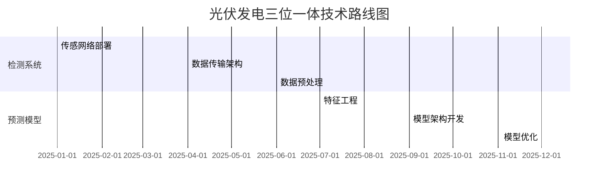

```mermaid
%% 技术路线图代码
gantt
    title 光伏发电三位一体技术路线图
    dateFormat  YYYY-MM
    section 检测系统
    传感网络部署       :done, 2025-01, 3m
    数据传输架构       :active, 2025-04, 2m
    数据预处理        :2025-06, 1m

    section 预测模型
    特征工程         :2025-07, 2m
    模型架构开发       :2025-09, 3m
    模型优化         :2025-12, 1m
```
